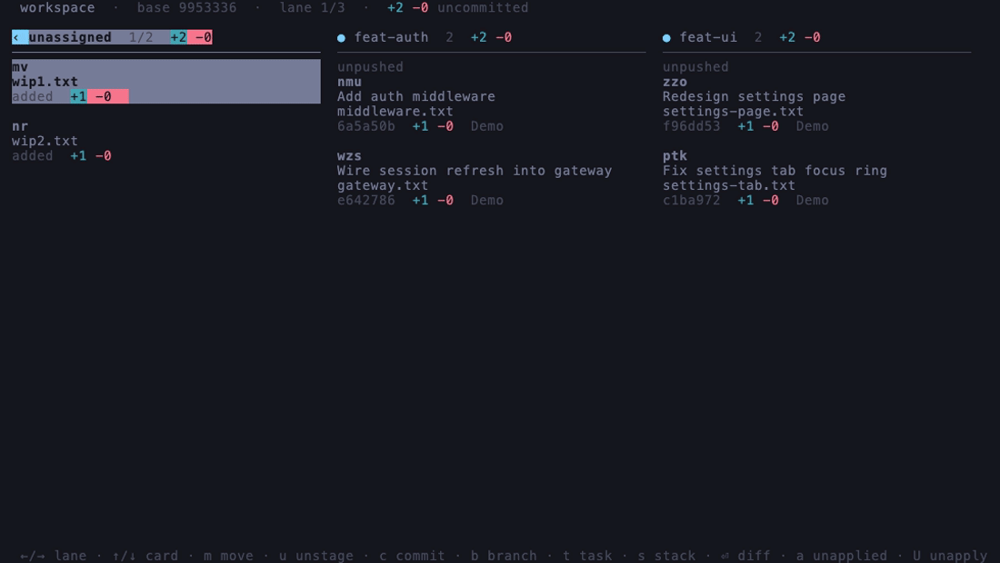
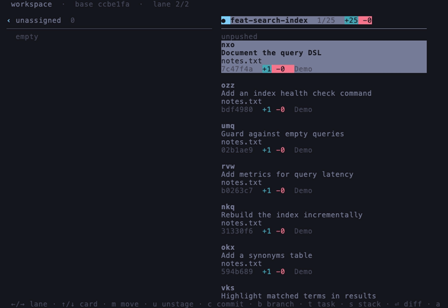
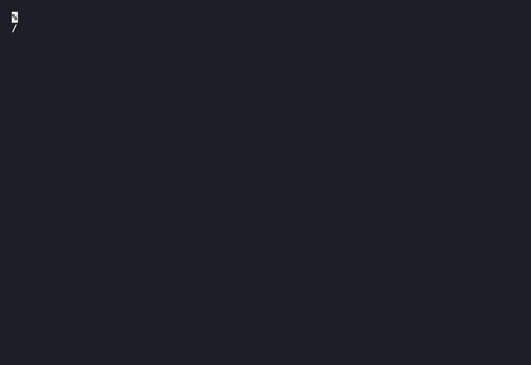
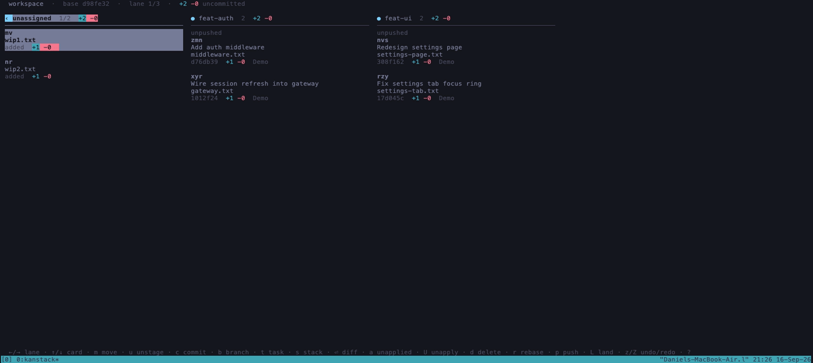

# kanstack

A kanban-style terminal UI for [GitButler](https://gitbutler.com)'s `but` CLI.

GitButler's whole premise is *parallel* stacks of work. Its built-in TUI renders them as a
single vertical commit graph, which flattens the one axis that makes the model interesting.
`kanstack` draws them as a board instead: one lane per stack, one card per commit, a backlog
lane for uncommitted work.



The lane header stays pinned no matter how deep you scroll — even into a 25-commit stack, or
past a lower branch's own commits in a stacked lane:

<table>
<tr>
<td></td>
<td></td>
</tr>
<tr>
<td>A long run of commits</td>
<td>A lane of three stacked branches</td>
</tr>
</table>

`b` spins up a new lane and, when a harness split is available (`cmux`, `tmux` as a
fallback, [Orca](#using-orca), or [Ghostty](#using-ghostty) on macOS), hands it straight to a coding agent — told which
GitButler branch it's in, not just dropped into a plain checkout:



## Install

Two things are required first:

1. **The [GitButler CLI](https://docs.gitbutler.com/cli-overview)**, `but` 0.22 or newer, on
   your `PATH`.

   Just the CLI, no GUI app (macOS or Linux):
   ```sh
   curl -fsSL https://gitbutler.com/install.sh | sh
   ```
   If you also want the GitButler desktop app, on macOS:
   ```sh
   brew install --cask gitbutler
   ```
   (this also puts `but` on your `PATH`). Otherwise, follow GitButler's own install docs
   linked above.
2. **A repository you have run `but setup` in.** If you don't have one yet:
   ```sh
   cd your-project
   but setup
   ```

Then install `kanstack` itself — no Rust toolchain required:

```sh
brew install dprovder/tap/kanstack
```

Or grab a prebuilt binary for macOS (Apple Silicon or Intel) or Linux (x86_64 or aarch64)
from the [Releases page](https://github.com/dprovder/kanstack/releases) and put it on your
`PATH`.

Or, with Nix:

```sh
nix run github:dprovder/kanstack
```

> On Apple Silicon the first run builds `but` from source and takes a few
> minutes; it's cached afterwards.

Want it in your own flake instead? Add `kanstack.url = "github:dprovder/kanstack"` as
an input, then `kanstack.packages.${system}.default` — the pinned `but`, `tmux`, and `git`
(+`cmux` on Apple Silicon) come bundled, so nothing needs installing separately. The dev
shell, packaging options, and per-device `but` provisioning are in
[docs/NIX.md](docs/NIX.md).

Then, from inside the repository you ran `but setup` in:

```sh
kanstack
```

### Building from source

If you'd rather build it yourself (or want to hack on it), this does need Rust — install it
via [rustup](https://rustup.rs) if you don't have it already:

```sh
git clone https://github.com/dprovder/kanstack
cd kanstack
cargo install --path .
```

See [docs/ARCHITECTURE.md](docs/ARCHITECTURE.md) for how it talks to `but`, the wire-format
notes, and the version-compatibility details a contributor would need.

## Setup

The very first time kanstack runs on a machine, it opens a short wizard before the board:
it checks whether `but`, `cmux`, `tmux`, `orca`, and `ghostty` are found (and, for `cmux`, whether the
required `but` version is installed), and lets you pick a default harness — cycling with
`←`/`→` through whichever known harnesses (`claude`, `codex`, `pi`, `opencode`, `kiro`,
`gemini`) were actually found on `PATH`, or just typing a custom command — and a split
backend (`auto`/`cmux`/`tmux`/`orca`/`ghostty`). Saving remembers your choices in
`$XDG_CONFIG_HOME/kanstack/env` (or `$HOME/.config/kanstack/env`), so you don't need to
export the equivalent environment variables every session — an explicit environment
variable always overrides what's saved there. `esc` skips it without picking anything.

Two more rows appear only when there's something to do: if `but` itself isn't found, an
"install GitButler CLI" action (with a confirm first, since it runs GitButler's own
`curl -fsSL https://gitbutler.com/install.sh | sh`); if `but` is found but has no
up-to-date coding-agent skill installed (`but skill check`), an "install/update GitButler
skill" action — the file that teaches whichever harness you spawn in a lane to use `but`
instead of plain `git`. Neither row shows once there's nothing left to fix.

Right after, first run also offers a one-time, equally skippable prompt to walk through
the tutorial below. Neither the setup wizard nor the tutorial offer reappears once you've
been through them once; run either again any time with:

```sh
kanstack --setup
kanstack --tutorial
```

## Tutorial

```sh
kanstack --tutorial
```

Builds a real, throwaway GitButler workspace in a temp directory and walks through moving,
diffing, committing, and landing a change — each step only advances once you've actually
done it, not on any keypress. Nothing it touches is one of your real projects; the practice
repo is thrown away when you're done. `esc` or `q` leaves any time.

## Keys

| key | does |
|---|---|
| `←/→`, `h/l` | move between lanes — wraps around |
| `↑/↓`, `j/k` | move between cards — wraps around |
| `shift ←/→` | page by however many lanes fit on screen at once |
| `shift ↑/↓` | skip to the next stacked branch, or the next folder if grouped |
| `g` / `G` | first / last card |
| `space` | select this card for a bulk move — again to deselect |
| `m` | pick up the selection (or just this card), then `←/→` for a lane, `↑/↓` to drop on a card, `⏎` to confirm |
| `u` | send this card back to the backlog — uncommit a commit |
| `a` | branches that aren't in the workspace — `⏎` applies one as a new lane |
| `U` | unapply this lane — its whole stack leaves, `a` brings it back |
| `d` | delete this lane — asks first |
| `r` | rebase onto the updated target — shows what will happen |
| `f` | resolve conflicts on this lane — `o`/`t` take ours/theirs per file, `A` hands the branch's conflicts to the lane's coding agent as a task |
| `tab` | on the unassigned lane: group its cards by folder, or back to a flat list |
| `⏎` | open the diff beside the board — `←` goes back, `m` commits or amends one hunk |
| `b` | new branch — stacks on the selected lane, `tab` for a parallel lane; `shift-tab` opens a harness split (`cmux`, `tmux` as a fallback, `orca`, or `ghostty`) — on by default for a parallel lane, off by default while stacking, groups with the base's pane if it already has one; asks for an optional initial message before creating anything, so `esc` cancels the whole branch |
| `t` | send a task to this lane's split pane — spawns one first if it isn't open yet |
| `s` | stack this whole lane onto another — rewrites history |
| `p` | push this lane — shows what it will do first |
| `L` | land this lane onto the target, no PR — shows what will happen first |
| `M` | open a PR for this lane's branch — pushes first if needed, then a modal for title/draft before it runs |
| `z` / `Z` | undo / redo the last operation — fires immediately, no confirm |
| `?` | help |
| `q` | quit |

Nothing is ever "staged" ahead of a commit — GitButler 0.22 dropped that step entirely, so
dropping a card onto a lane commits or amends it there immediately, and the footer spells
out which before you confirm.

| drop | result |
|---|---|
| commit → lane | move the commit to that branch |
| commit → commit | squash them together |
| commit → unassigned | uncommit it into the worktree |
| file → empty lane | commit it there — prompts for a message |
| file → lane with commits | amend it into the tip, no prompt |
| file → commit | amend it into that commit |

Squash and amend are not separate features from a plain move — they're the same drop
gesture, aimed at a card instead of a lane. `u` is the mirror image, aimed at the backlog.

**A drop always names the changes it commits explicitly.** `but commit` with no changes
named sweeps in everything uncommitted — fine from a shell, wrong for a board, where
dropping a card onto a lane is precisely how you say what belongs there. kanstack always
passes the specific file or hunk id(s) being moved.

## Using Orca

kanstack can hand lanes to [Orca](https://github.com/stablyai/orca)'s terminals as well as
cmux's or tmux's. It is picked automatically when kanstack runs in an Orca terminal (which
Orca marks with `ORCA_TERMINAL_HANDLE`) and isn't in a cmux or tmux pane, or with
`KANSTACK_SPLIT_BACKEND=orca`. Orca's CLI has to be registered under Settings in the app so
`orca` (`orca-ide` on Linux) is on `PATH`, or pointed at with `KANSTACK_ORCA_BIN`.

Orca's own model is one git worktree per agent, but every kanstack lane shares GitButler's
single workspace checkout. So kanstack **never runs `orca worktree create`**: a lane's
terminal is split off kanstack's own, and lives in whichever Orca worktree kanstack is in.
If that split isn't possible (a stale terminal handle, say) the lane opens as a new tab in
the repository's existing worktree instead, which needs the repository to have been added to
Orca.

A few things differ from the other two:

- **Direction.** Orca can only place a new pane to the right of, or below, the one it splits.
  `KANSTACK_ORCA_DIRECTION` and `KANSTACK_ORCA_CHAIN_DIRECTION` default to `below` and
  `right`; `left` and `above` are accepted but behave as `right` and `below`, and so does
  `KANSTACK_SPAWN_DIRECTION`.
- **Busy and idle** come from Orca's own agent detection rather than from CPU usage. A
  harness Orca doesn't recognize will read as busy, and so will one waiting on an approval
  prompt.
- **`t` doesn't wait for the harness.** In testing, Orca accepted a message sent to a
  terminal with no agent running, so pressing `t` before the harness has finished starting
  can type the task into whatever is there — wait for it to be ready, as with the others.
- **No real tab support yet for a stacked branch's pane.** `KANSTACK_STACK_PANES=tabbed`
  (the default) falls back to the orthogonal split below, the same as `=split` — see
  "Driving panes from a script or an agent" above.

Orca support was written against Orca's CLI reference and source, and exercised against
Orca's headless runtime (`orcad`) — splitting, launching, focusing, closing and the
worktree handling all behave as described. It hasn't been run in the desktop app, and idle
detection hasn't been seen to report *idle* (only busy). If a lane misbehaves,
`KANSTACK_SPLIT_BACKEND` pins one of the others.

## Using Ghostty

On macOS, kanstack can hand lanes to [Ghostty](https://ghostty.org) itself, with no tmux or
cmux in between. It needs Ghostty 1.3 or newer, the first release with AppleScript support,
and it is picked automatically when kanstack runs in a Ghostty window (`TERM_PROGRAM` is
`ghostty`) that isn't a cmux or tmux pane, or with `KANSTACK_SPLIT_BACKEND=ghostty`. cmux is a
Ghostty fork and sets `TERM_PROGRAM=ghostty` too, so cmux and tmux panes keep their own
backends, and a machine that merely has `cmux` installed still gets Ghostty inside plain Ghostty.

kanstack drives Ghostty through `osascript`; `KANSTACK_OSASCRIPT_BIN` points it at a different
one. The first time, macOS asks whether to let the app running kanstack control Ghostty. If
that was refused, or the prompt never came, turn it on under System Settings > Privacy &
Security > Automation.

A few things differ from the others:

- **No busy or idle from the terminal itself.** Ghostty can say whether a pane exists, and
  nothing else, so a closed pane reads `dead` and every other reading comes from the agent's
  own reports (`kanstack report`, which Claude Code's hooks call) and from kanstack tracking
  the harness's process.
- **A pane stays open after its harness exits.** Ghostty leaves the finished pane on screen,
  and there is no way to ask it whether the command is done, so an exited harness doesn't
  read `dead`. Close the pane or run `kanstack stop`.
- **The harness is started by `sh -c`, not typed into a shell.** So there is no shell prompt
  in the pane and your `~/.zshrc` has not run. kanstack passes along your `PATH` and every
  `KANSTACK_*` variable; other variables that exist only in your interactive shell won't
  reach the harness.
- **`kanstack stop` ends the harness itself.** Closing a pane through AppleScript removes it
  from the window, but in Ghostty 1.3.1 that did not end the process inside it: a `sleep` and a
  `cat` outlived their closed panes by many minutes (closing a whole window did end its
  process). So `stop` also sends `SIGTERM` to the pane's recorded shell and everything below
  it, even if closing the pane reported a problem. It only does so if that pid is still the
  shell that recorded it: pids are reused, so a process that began after the pid file was
  written is left alone. It is a plain `SIGTERM`, so a harness that ignores it keeps running,
  and it needs a recorded pid, so a pane whose shell never wrote one is only closed.
- **Don't expect a lane to start while the Mac is idle.** Once, with nobody at the machine,
  every new pane opened but ran nothing until someone was back; it isn't understood yet.
- **Finding its own pane.** Ghostty gives a shell no id for its own pane, so for the first
  lane kanstack sets its terminal's title to a unique marker, looks that up, and sets the title
  back. The lanes after it split off the one before.
- **Direction.** All four work. `KANSTACK_GHOSTTY_DIRECTION` and
  `KANSTACK_GHOSTTY_CHAIN_DIRECTION` default to `above` and `right`, as for tmux. A new pane
  takes keyboard focus.
- **Labels.** The new pane is titled with the branch name until the harness sets its own title.
- **No real tab support yet for a stacked branch's pane.** `KANSTACK_STACK_PANES=tabbed`
  (the default) falls back to the orthogonal split, the same as `=split` — see "Driving
  panes from a script or an agent" above.

What is said above about how Ghostty behaves was measured against Ghostty 1.3.1, including a
`kanstack spawn` run from a shell and a lane started from the board; [docs/ARCHITECTURE.md](docs/ARCHITECTURE.md)
says which parts were and which weren't.

## Driving panes from a script or an agent

Everything the board does to a harness pane is also available without the board, so an
agent in one pane can start and talk to others. Run these inside the cmux, tmux, Orca or Ghostty the
panes live in:

```sh
kanstack spawn <branch> [--agent codex] [--prompt "..."] [--json]   # creates <branch> if it doesn't exist
kanstack send <branch|session> "..." [--json]
kanstack status [--json]
kanstack focus <branch|session> [--json]
kanstack stop <branch|session> [--json]                     # closes the pane, ends its harness
kanstack report <busy|idle> [<branch>] [--json]              # what an agent says about itself
kanstack prune [--json]                                     # forgets workstreams whose pane is confirmed gone
kanstack events [--since <offset>] [--follow] [--json]      # tails the append-only events log
```

Every one of these takes `--json`, for a script or another agent to drive kanstack without
parsing human-readable text — see "Exit codes, and `--json` for every subcommand" below for
the shared envelope and error contract. `<session>` is a pane id as `kanstack status` prints it. `spawn` splits off the pane you run it
from, to its right; `KANSTACK_SPAWN_DIRECTION` (`left`, `right`, `above` or `below`, and
saveable in the config file) changes that without touching where the board puts its lanes. `--agent` runs that harness instead
of `$KANSTACK_HARNESS` for this one pane.

**Handing off to a stacked branch.** `spawn <branch>` works on a branch already stacked on
another, and when that other branch already has a pane open — an agent finishing its own
turn and spawning a successor on the branch stacked above it, say — the new pane is grouped
with the sibling's instead of chaining off wherever the last spawn happened to land, so a
stack's agents stay visually together. By default that's a real tab alongside the sibling
(tmux and cmux both have one; Orca and Ghostty don't yet, and fall back to the split below).
`KANSTACK_STACK_PANES=split` places it as a split instead, off the sibling, in the direction
orthogonal to the ordinary chain direction — so a horizontal lane chain gets a vertical stack
split and vice versa — which still reads as its own cluster rather than continuing the chain.
Saveable in the config file, same as the other standing preferences above.

The board's own `b`/`shift-tab` groups the same way when you stack a branch with the split
checkbox checked and its base already has a pane open — same `KANSTACK_STACK_PANES` choice,
same fallback for Orca and Ghostty. Unlike a parallel lane, the checkbox defaults off for a
stacked branch, so `b` keeps its long-standing "stacking shares the base's pane" behavior
unless you opt in.

`kanstack status --json` prints one JSON document instead of the table, for a script or an
agent to parse:

```json
{"schema":1,
 "workstreams":[
  {"branch":"fix-login","pane":"%3","agent":"claude","item":"GH-4","status":"busy",
   "lane":{"commits":3,"conflicted":false,"behind":0,"rebase":"clean","landed":false,
           "push":"unpushed","uncommitted":0}},
  {"branch":"planned","pane":null,"agent":null,"item":null,"status":"no-pane","lane":null}
 ],
 "workspace":{"behind":2,"uncommitted":1,"fetched":"2026-09-21T03:07:40.977+00:00"},
 "workspace_blocked":null}
```

Every key is always present (`null` when there's no value), one entry per registered
workstream, in registry order. `status` is `busy`, `idle`, `waiting`, `dead`, `unknown` or
`no-pane` (the workstream has no pane). New fields and new `status` values may be added under
the same `schema` number, so ignore keys you don't know and read a `status` you don't
recognize as `unknown`; it changes only if an existing field is renamed, removed or
reinterpreted.

`lane` is the branch's git state, from `but status`, so an agent can tell without running it:

| field | meaning |
| --- | --- |
| `commits` | commits on the lane |
| `conflicted` | a commit on the lane is conflicted now — `f` opens the picker. This only happens once `but pull` has rebased the lane; before that, `rebase` is the warning |
| `behind` | commits on the lane's remote branch that the lane doesn't have |
| `rebase` | what updating the lane from upstream would do: `clean`, `conflicts`, `integrated` or `empty`; `null` when there is nothing to say, which includes right after `but pull`, when the update has already happened |
| `landed` | the lane has landed upstream and `but pull` will remove it; its commits can't be changed |
| `push` | `pushed`, `unpushed`, `needs-force`, `local-only`, `integrated` or `unknown`. `needs-force` means a plain push would be refused: the lane's pushed history was rewritten, or its remote branch has commits the lane lacks (it has diverged) |
| `uncommitted` | uncommitted files assigned to the lane's stack. GitButler's desktop app does the assigning; with the command line alone nothing gets assigned, so those changes show up under `workspace.uncommitted` instead |

`workspace.behind` is how many commits the target branch has that the workspace doesn't, which
is what `but pull` would bring in; `workspace.uncommitted` counts changes no lane owns yet.

**These are as of the last fetch.** `but status` reads remote-tracking refs and never fetches,
and neither does `kanstack status`, so `behind`, `landed`, `rebase` and `workspace.behind`
only change once something fetches (`but pull --check` fetches and changes nothing else).
`workspace.fetched` is when that last happened, so a consumer can judge how stale they might
be; it is `null` if the workspace never fetched. A landed lane is only visible between a fetch
and the `but pull` that removes it, after which its `lane` is `null`.

`lane` and `workspace` are `null` when `but` can't be reached, and `lane` alone is `null` for
a branch that is no longer in the workspace. Reading them costs one `but status -u` call, a few
tens of milliseconds more than plain `but status`; `-u` is the only way `but` fills in
`rebase`. Every value above was read from a real capture, from a scratch repository driven into
each state (`tests/fixtures/status_lane_*.json`), except the assigned-files count, which this
`but` cannot produce from the command line and is hand-set in its test.

`workspace_blocked` is set — to `but`'s own explanation, kept verbatim — when the workspace is
locked by a stray commit on `gitbutler/workspace` (see "A commit on the workspace head locks
everything" in [docs/ARCHITECTURE.md](docs/ARCHITECTURE.md)): `but` refuses every subcommand
until it's fixed, `but teardown` or a reset among them, which is worth telling apart from
`but` merely being unreachable — not installed, not a repo, a transient failure — since it
names one specific, fixable cause instead of "try again". `workspace` is `null` whenever this
is set too, since a blocked `but` refuses `status` along with everything else. `null` in the
ordinary case.

Unlike the table, `--json` works outside cmux, tmux, Orca and Ghostty, and when the multiplexer can't
be reached: it still lists every workstream, with `unknown` for those that have a pane. An
empty registry gives `{"schema":1,"workstreams":[],"workspace":null,"workspace_blocked":null}`.
What it will not do is paper over a registry file that is corrupt or unreadable: that exits
non-zero with the reason on stderr (or, under `--json`, the error document below) and nothing
on stdout, because starting over would orphan every pane it tracks.

**`kanstack prune [--json]`** forgets workstreams whose pane the poll has confirmed gone —
closed outside kanstack, the process died — the same `dead` reading `status` shows. It only
ever removes a `dead` one: a poll that comes back `unknown`, because no multiplexer is
reachable right now or it failed to answer, leaves every workstream alone rather than
guessing. That makes it safe to run from anywhere, on a schedule or before every `spawn`, with
no risk of it wiping the registry just because it wasn't run from inside a pane this time.

```json
{"schema":1,"pruned":["old-spike"]}
```

The table form prints one `pruned <branch>` line per branch removed, or `nothing to prune`.
`schema` versions independently of `status --json`'s.

### Tailing kanstack without polling: `kanstack events`

kanstack has no daemon, no server and no push channel — but it does keep one append-only
JSONL file per repository (in the same state directory as the workstream registry) that an
orchestrator can `tail -f` directly, or read through `kanstack events`:

```sh
kanstack events                       # print everything logged so far
kanstack events --since 4096          # print only what was appended after byte 4096
kanstack events --follow              # keep printing new lines as they arrive, like tail -f
```

Two commands write to it. `kanstack report <busy|idle|waiting>` appends one line every time
it's called:

```json
{"schema":1,"ts":"2026-09-22T13:04:05Z","branch":"fix-login","kind":"report","state":"busy"}
```

And a successful `spawn`, `stop` or `prune` appends a lifecycle line — `command` is the
subcommand, `branch` is the branch it named (`spawn`'s branch, or whatever `<branch|session>`
`stop` was given, which is not necessarily resolved to a branch name); `prune` can touch
several workstreams or none, so it logs one event with no `branch` rather than guessing which:

```json
{"schema":1,"ts":"2026-09-22T13:05:10Z","kind":"lifecycle","command":"prune"}
```

`schema` versions this shape independently of every other `--json` schema in kanstack. Both
kinds are deliberately thin — a doorbell, not the payload: seeing a line is a cue to go read
`kanstack status --json` for what actually happened, not something to parse for the state
itself. Appending is best-effort, like every other write in this file — a full disk or a
missing state directory never fails the command it's attached to, it just means that one event
doesn't get logged.

`kanstack events` itself always prints raw JSON lines on success, whether or not `--json` is
given; `--json` only changes how a *failure* (e.g. an unreadable log) is reported, the same
generic error envelope documented below. It needs no multiplexer and never touches the
workstream registry, so — like `report` — it's safe to run from anywhere. There is no log
rotation or size limit yet; if a repository's log ever grows enough to matter, that's worth
revisiting, but nothing does that today.

### Exit codes, and `--json` for every subcommand

`spawn`, `send`, `focus`, `stop` and `report` take `--json` too, for the same reason
`status`/`prune` do: something driving kanstack from a script or another agent shouldn't have
to parse human-readable text. Success is one document on stdout, this shape for every command
but `status` and `prune` (which keep the shapes documented above, independently versioned):

```json
{"schema":1,"ok":true,"command":"spawn","workstream":"fix-login",
 "result":{"created":true,"pane":"%7","agent":"claude","workspace":null}}
```

`workstream` is always the branch the command acted on. `result` is command-specific:
`spawn`'s `created` says whether the branch was new; `workspace` is the multiplexer's
workspace the pane opened in, when the backend has one (cmux does; tmux, Orca and Ghostty
don't) — same idea as `spawn`'s own text output, `(workspace:1)`. `send`/`focus`/`stop` give
back `{"pane":"..."}`, the pane the command acted on (`null` for `stop` on a workstream that
had none to close). `report`'s is `{"state":"busy"}` — but only when `--json` is given;
without it, `report` still prints nothing at all, same as before this existed, since Claude
adds a `UserPromptSubmit` hook's stdout to what the model sees.

A failure is one document too, with the same `command` and a `null`-free `error`:

```json
{"schema":1,"ok":false,"command":"spawn",
 "error":{"code":"workstream_exists","message":"fix-login already has a pane open — use `kanstack send`, `focus` or `stop`"}}
```

Without `--json`, a failure is unchanged from before: the same text on stderr, nothing on
stdout. Either way, the process exit code says what kind of thing went wrong — coarser than
`error.code`, since several conditions share one:

| exit | meaning | `error.code` |
| --- | --- | --- |
| `0` | success | — |
| `1` | internal: a bug, a corrupt registry, an I/O failure below everything else | `internal` |
| `2` | invalid arguments — caught before anything ran | `invalid_arguments` |
| `3` | nothing to act on: the target names no workstream, or it has no pane | `unknown_workstream`, `no_pane` |
| `4` | conflict: `spawn` on a branch that already has a live pane | `workstream_exists` |
| `5` | an external dependency is unavailable or refused: the split backend, `but`, the harness, or delivering a message to a pane | `multiplexer_unavailable`, `harness_unavailable`, `but_failed`, `delivery_failed` |

`error.code` is the precise reason within that bucket, so a caller that needs the finer
distinction `--json` gives never has to pattern-match prose to get it. `harness_unavailable`
is reserved — kanstack has no harness-availability preflight today, it just types a launch
line into a pane — defined now so a later check has somewhere to report to.

### Where busy, idle and waiting come from

The multiplexer's own reading (CPU for cmux and tmux, Orca's idle detection) is a guess, and
some multiplexers can't make one (Ghostty can only say whether a pane still exists). So a harness can say for itself: `kanstack report busy`
when a turn starts, `idle` when it ends, and `waiting` when it stops on a permission prompt,
from any script or hook. `<branch>` defaults to `$KANSTACK_BRANCH`, which kanstack sets in
every pane it launches; it prints nothing, needs no multiplexer, and never reads the
registry, so it is safe to run on every turn. `waiting` is something only an agent can say:
a pane stopped on a prompt looks exactly like one at rest. The board shows it as
`◆ needs you`.

For Claude Code, kanstack does this for you: it launches `claude` with `--settings` carrying
hooks for the start and end of a turn, each tool call, permission prompts, and turns that die
on an API error. They run alongside your own hooks rather than replacing them, and nothing on
disk is edited. Other harnesses get no hooks, because kanstack doesn't yet know a safe way to
hand them any at launch; they keep the multiplexer's reading, and can call `kanstack report`
themselves. `KANSTACK_STATUS_HOOKS=off` launches every harness without them.

The same `--settings` also carries a second, narrower `PreToolUse` hook — `kanstack claim`,
matching only `Edit`/`Write`/`MultiEdit` — that can deny a file edit outright when another live
lane is already busy editing the exact same file, instead of letting both land and reconciling
the collision afterward. See [docs/automation.md](docs/automation.md#concurrency-guarantees)
for what problem this solves and its limits (whole-file granularity, Claude Code only for now).

How a report and the multiplexer's reading combine:

- A pane the multiplexer says is gone is always `dead`, and so is one whose shell kanstack is
  tracking itself (see below) and has exited.
- Otherwise a fresh report wins, and one CPU reading never overrides it. `busy` and `idle` are
  believed for ten minutes, `waiting` for twelve hours, since a prompt left overnight is
  exactly what it is for.
- **Escape fires no hook, and neither does answering a permission prompt with "No"** (checked
  against real Claude), so a `busy` report can be left behind over a pane at its prompt. When
  a `busy` report is over twenty seconds old and the pane reads idle, kanstack looks twice
  more, over a couple of seconds; if the pane stays quiet it believes the pane, and writes
  `idle` over the stale report so a later blip of CPU can't bring it back. (Real work dips
  below the threshold for a moment now and then, which is why one quiet reading isn't enough.)
  This costs a second or two only when such a contradiction exists.
- **A stale `waiting` is not retracted.** After "No" or Escape on a prompt, the turn simply
  ends, and a pane at rest looks exactly like one with a prompt pending. So `◆ needs you` stays
  until you next type something. A false "needs you" costs a glance; a missed prompt could
  cost hours.
- A report that has run out reads `unknown` unless the multiplexer, or the process table
  below, knows better, rather than leaving the last status standing.

#### When the multiplexer can't say: kanstack watches the process itself

Some multiplexers can only say whether a pane exists (Ghostty's scripting is one), and some
keep a pane listed after its command has exited, so neither busy, idle nor "it finished" can
come from them. For those, kanstack follows the pane's process itself. The launch line starts
with `sh -c 'printf %s "$PPID" > "$0"' <file> && `, so the pane's own shell writes its pid to
a small file, one per branch, under `pids-<repo>` next to the reports, before it runs the
harness. (`$PPID` rather than `$$` because it means the same in every shell, fish included; the
file's path is passed as an argument so a path with spaces or a quote needs no extra quoting.)
Each poll then reads `ps` once, and only if some pane with a pid needs it:

- the shell is not in the process table: `dead`. This is how a finished harness is noticed
  where its pane stays listed;
- otherwise the shell and everything under it together using more than 3% CPU: `busy`, else
  `idle`, the same threshold the tmux and cmux readings use.

It ranks below the multiplexer's own busy or idle reading (used only where that has none) and,
like it, below a fresh report. It also takes part in the stale-`busy` check above, so an
interrupted turn is corrected on such a multiplexer too, from the process table's look at the
pane. A pane whose shell hasn't written its pid yet, or whose pid file can't be read, simply has
no reading. Like a report, the pid file is deleted when a new pane opens on the branch and on
`stop`.

It is on where the multiplexer asks for it, and `KANSTACK_TRACK_PIDS=1` (`true`, `on`, `yes`)
turns it on for any of them, which is how to try it under tmux; `0` (`false`, `off`, `no`)
turns it off. It has limits, and they matter:

- CPU is a guess, exactly as it is for tmux and cmux: a harness waiting on the network reads
  `idle`, and a busy one that happens to dip reads `idle` for a moment.
- It follows the pane's *shell*, not the harness. Where the shell outlives the harness, which
  is every multiplexer that gives a pane a shell and returns to its prompt when the harness
  exits, a finished harness reads `idle`, not `dead`. `dead` only means the shell itself went.
- A recorded pid could in principle be reused by an unrelated process after the shell exits,
  which would read as a live pane. Not seen, and not guarded against when *reading* status.
  `kanstack stop` does guard against it before ending anything (see above): it compares how
  long the process has run with when the pid was recorded.

Checked on tmux 3.6, with a `list-panes` wrapper that hides `pane_pid` so tmux could say only
that panes exist, as Ghostty would: a shell running a CPU loop read `busy`, one running
`sleep` read `idle`, killing the loop's process left `idle`, and killing a shell in a pane
kept listed with `remain-on-exit` read `dead` (tmux's own reading of that pane says `idle`).
With a `busy` report over a quiet shell, the status went from `busy` to `idle` on the first
poll after twenty seconds, which took 2.7 seconds, and the report was rewritten as `idle`; the
same report over a shell running a CPU loop stayed `busy` and cost nothing. The pid file held
the pane shell's pid under zsh, bash, dash, ksh and tcsh. Fish is not among them; it was not
installed. Not yet checked against Ghostty itself.

Verified against real Claude, one scenario each: a Write prompt (approved; "yes, don't ask
again"; "no"), two prompts in one turn, a WebFetch prompt, plan mode's approval dialog, and an
`AskUserQuestion` question all report `waiting`, and `PostToolUse` takes it back to `busy` on
approval. After approving, `waiting` stays for as long as the tool runs, since nothing fires at
the moment of approval. A prompt left for 80 seconds stays `waiting` throughout.

Each command is its own process, so panes are tracked in a per-repository registry under
`$XDG_STATE_HOME/kanstack` (`~/.local/state/kanstack`; `KANSTACK_STATE_PATH` relocates it).
The board records into it too, and picks up panes the commands opened.

## No refresh key

A filesystem watcher follows the worktree and `.git`, so the board tracks changes made in
your editor or another terminal on its own — that's the whole reason there's no refresh
key. Navigation never shells out, so arrow keys are instant regardless of what the watcher
is doing; the refresh it triggers runs on its own thread and never blocks input.

## Reporting a bug

Snapshot mode renders a captured payload offline, so a report needs no access to your repo:

```sh
but status -f --json > board.json
kanstack --snapshot board.json --size 160x40
```

Attach `board.json`. Redact it first if your branch names are sensitive.

## Tests

```sh
cargo test                                            # unit + rendering
cargo test --test live -- --ignored --test-threads=1  # against a real `but`
```

The live tests build a throwaway repository with `HOME` redirected into a temp directory,
so they never touch your GitButler project registry or settings.

## Status

Usable. Reading, moving, committing by hunk, amending, branching, stacking, deleting,
pushing, rebasing, landing, opening a PR, and undo/redo all work and are covered by tests
against the real CLI. Not yet built:

- **CI and review badges are unverified.** The wire types are bound and rendered, but every
  workspace tested so far had no forge attached, so `ci` and `reviewId` were always null.
  If you use this with real PRs, that is where bugs will be. Opening a PR itself (`M`) is
  untested against a real forge for the same reason.
- Flipping through adjacent cards' diffs without leaving the pane. `→` used to do this,
  but both arrows now close, which is the clearer rule; `n`/`p` or `[`/`]` would give the
  behaviour back without overloading the arrows.
- Reordering commits within a lane. `but move <commit> --above/--below <target>` does it;
  the open question is the gesture, since dropping a card on a card already means squash.

See [docs/BEHAVIOR.md](docs/BEHAVIOR.md) for the reasoning behind specific keys and drop
targets — hunk-level diffs, line-count semantics, rebasing, the branches drawer, deleting a
lane, undo/redo, lane-state dots, grouping, bulk moves, restacking, card identifiers, and
why push, land, and opening a PR each ask first.

## Licence and relationship to GitButler

`kanstack` is MIT licensed. It is an independent program that invokes the `but` CLI as a
subprocess; it contains and links no GitButler source, and is not a derivative work of it.

**This project is not affiliated with, endorsed by, or sponsored by GitButler Inc.**
"GitButler" is their name, used here only to describe what this tool interoperates with.
GitButler itself is distributed under the Functional Source License (FSL-1.1-MIT), whose
terms govern their code — not this repository. If you vendor or fork any GitButler code
into a project, those terms apply to you and this notice does not cover it.

Not legal advice.
